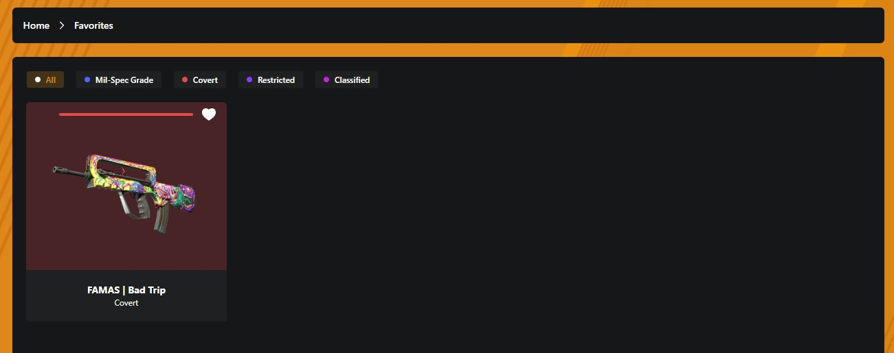

# Programacion Web Avanazada - 2025

## <strong>Trabajo Práctico: REACT

## Integrantes

- [FAI-3169] Benitez, Franco Fabian
- [FAI-4594] Pesce, Matías Nicolás
- [FAI-3220] Reyes Castelló, José Vicente

## Enlace a versión web

[!Eco](https://react-tp2-pcyc.vercel.app/)

## Descripción

<table>
<tr>
<td>

</td>
<td>
<p align="Justify">!Eco es tu página para skins del CS2, podes buscar tu arma preferida, ver sus skins y a que caja pertenece, y también armarte un listado de favoritos y hacer tu propia colección.</p>
</td>
</table>

## Guia de instalación y uso del proyecto

### Requisitos

- Tener instalado [Node.js](https://nodejs.org/)

### Instalación

1. Clonar el repositorio con el siguiente comando:

```bash
git clone https://github.com/Niicoph/react-tp2.git
```

2. Abrir la terminal en el directorio _/react-tp2_ e ingresar el siguiente comando:

```bash
npm install
```

3. Luego de realizada la instalación, abrir la terminal en el directorio _/react-tps_ e ingresar el siguiente comando:

```bash
npm run dev
```

4. La terminal retornará el siguiente texto:
```bash
> react-tps@0.0.0 dev
> vite


  VITE v6.3.4  ready in 594 ms

  ➜  Local:   http://localhost:5173/
  ➜  Network: use --host to expose
  ➜  press h + enter to show help
```

5. Copiar la URL que figura en local, en este caso:
```bash
http://localhost:5173/
```

## Guia de uso

###

#### Al ingresar encontras con el listado de skins

<br>

> Puede suceder que las imágenes de las armas en ciertas condiciones no carguen, esto se debe a que el host de las mismas (https://raw.githubusercontent.com) tiene sus políticas de uso y devuelve un error 429 por la cantidad de solicitudes realizadas.

<br>

> Podes navegar por las distintas páginas de skins.

#### En el header tenes hay varias funciones


#### Podes filtrar por rareza del arma


#### También por tipo de arma

<table>
<tr>

</tr>
<tr>

</tr>
</table>

#### Sino podes usar el buscador

<table>
<tr>

</tr>
<tr>

</tr>
<tr>

</tr>

#### Cambiar el idioma


#### Y ver tus favoritos


#### Cada skin se muestra en una tarjeta

<table>
<tr>

</tr>
</table>

> ¿Te acordas del ícono en la parte superior derecha? Probá hacerle click

<table>
<tr>

</tr>
</table>

> Ahora sabes que tu skin está en entre tus favoritos

#### Ahora vamos a ver tus favoritos



> Acá también podes filtrar por rarezas

#### Cuando entras a tu skin podes ver más información y en qué caja la podes conseguir


#### Y no te olvides que siempre podes volver al inicio haciendo click en la ruta


> Y un secreto, también hay dos íconos que tienen esa función oculta

<details>
    <summary>Cof cof</summary>
        
        
</details>
